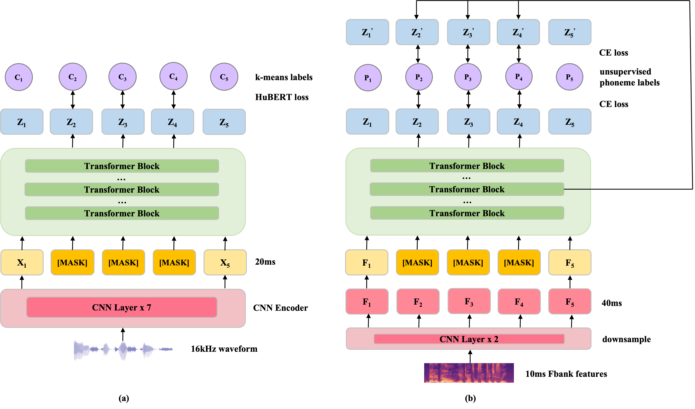

# __Fast-HuBERT__
## Paper
[https://arxiv.org/abs/2309.13860](https://arxiv.org/abs/2309.13860)
## Intro 
Existing speech-based SSL models face a common dilemma in terms of computational cost, which might hinder their potential application and in-depth academic research. Fast-HuBERT is proposed to improve the pretraining efficiency.

Fast-HuBERT optimizes the front-end inputs, loss computation and also aggregates other SOTA techniques, including [ILS](https://github.com/microsoft/UniSpeech) and [MonoBERT](https://arxiv.org/abs/2306.08920).

Fast-HuBERT can be trained in 1.1 days with 8 V100 GPUs on Librispeech benchmark, without performance drop compared to the original implementation, resulting in 5.2X speedup. 


## Model 



## Requirements and Installation
```
git clone https://github.com/pytorch/fairseq
cd fairseq
pip install --editable ./
git clone https://github.com/yanghaha0908/FastHuBERT
```

## Wandb log
Pretrain:
[https://wandb.ai/yanghaha/FastHuBERT?workspace=user-yanghaha](https://wandb.ai/yanghaha/FastHuBERT?workspace=user-yanghaha)  
<!-- Finetune:
[S1]() &ensp;[S2]()&ensp; [S3]()&ensp; [S4]()&ensp; [S5]()&ensp; [S6]()&ensp; [S7]()&ensp; [S8]() -->

## Checkpoint for S8 system
Pretrain: [checkpoint280.pt](https://drive.google.com/file/d/1luGaCzw9_LnbWKF0veztGTqgBNokmNqb/view?usp=drive_link)  
Finetune: [fasthubert_s8.pt](https://drive.google.com/file/d/1nm8p4ouIYs46LYZ846FNMNKfrOIclD63/view?usp=drive_link)  
Decoding-related files are uploaded to the `decode` folder.


## Data preparation
<!-- Refer to [this](https://github.com/chenxie95/fairseq-asr/blob/main/examples/speech_recognition_sjtu/prep_data_npyfile.py) to extract Fbank features.  private repo 这行需要写吗?-->

Refer to [this](https://github.com/facebookresearch/fairseq/tree/main/examples/hubert#data-preparation) to prepare data.  

Fbank extraction code is under [utils](https://github.com/yanghaha0908/FastHuBERT/tree/master/utils). Prepare the info file like `librispeech_example.info`, and execute `run.sh`.


## Pre-train a Fast-HuBERT model

```
$ python fairseq_cli/hydra_train.py \
    --config-dir /path/to/FastHuBERT/config/pretrain \
    --config-name fasthubert_base_lirbispeech \
    common.user_dir=/path/to/FastHuBERT \
    task.data=/path/to/data \
    task.label_dir=/path/to/labels \
    task.labels=["phn"] \
    model.label_rate=50 \
```


## Fine-tune a Fast-HuBERT model with a CTC loss

```
$ python fairseq_cli/hydra_train.py \
    --config-dir /path/to/FastHuBERT/config/finetune \
    --config-name base_100h \
    common.user_dir=/path/to/FastHuBERT \
    task.data=/path/to/data 
    task.label_dir=/path/to/transcriptions \
    model.w2v_path=/path/to/checkpoint \
```


## Decode a FastHuBERT model

### Viterbi decoding
```
$ python examples/speech_recognition/new/infer.py \
    --config-dir examples/hubert/config/decode \
    --config-name infer_viterbi \
    common.user_dir=/path/to/FastHuBERT \
    common_eval.path=/path/to/checkpoint \
    task.data=/path/to/data \
    task.normalize=[true|false] \
    task._name=fasthubert_pretraining \
    dataset.gen_subset=test \
```

### KenLM / Fairseq-LM decoding
```
$ python examples/speech_recognition/new/infer.py \
    --config-dir examples/hubert/config/decode \
    --config-name infer_kenlm \
    common.user_dir=/path/to/FastHuBERT \
    common_eval.path=/path/to/checkpoint \
    task.data=/path/to/data \
    task.normalize=[true|false] \
    task._name=fasthubert_pretraining \
    dataset.gen_subset=test \
    decoding.lmweight=2 decoding.wordscore=-1 decoding.silweight=0 \
    decoding.beam=1500 \
    decoding.lexicon=/path/to/lexicon \
    decoding.lmpath=/path/to/arpa \
```


## Citation
```
@article{yang2023fast,  
  title={Fast-HuBERT: An Efficient Training Framework for Self-Supervised Speech Representation Learning},  
  author={Yang, Guanrou and Ma, Ziyang and Zheng, Zhisheng and Song, Yakun and Niu, Zhikang and Chen, Xie},  
  journal={arXiv preprint arXiv:2309.13860},  
  year={2023}
}
```
<br>
Contact: yangguanrou@sjtu.edu.cn